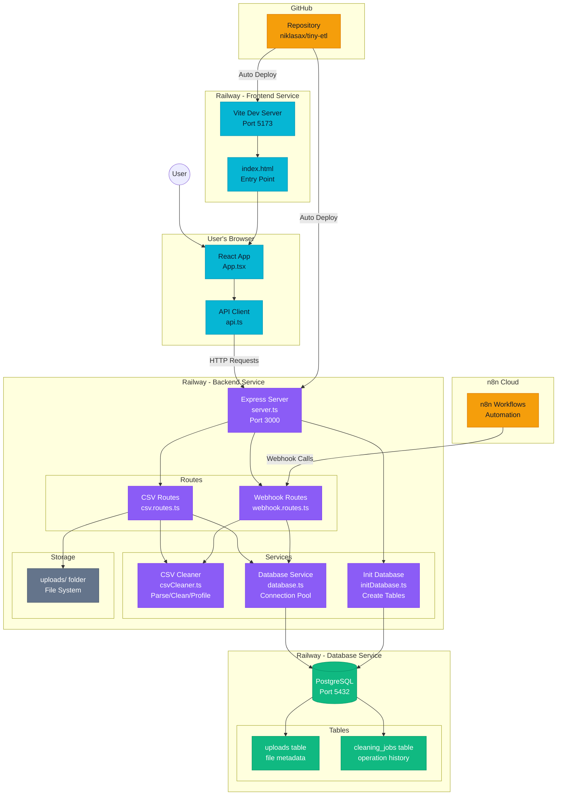
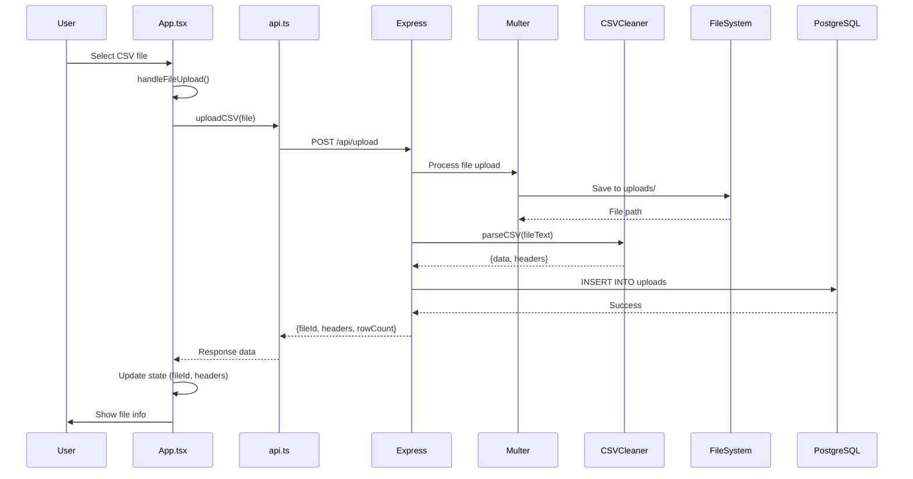
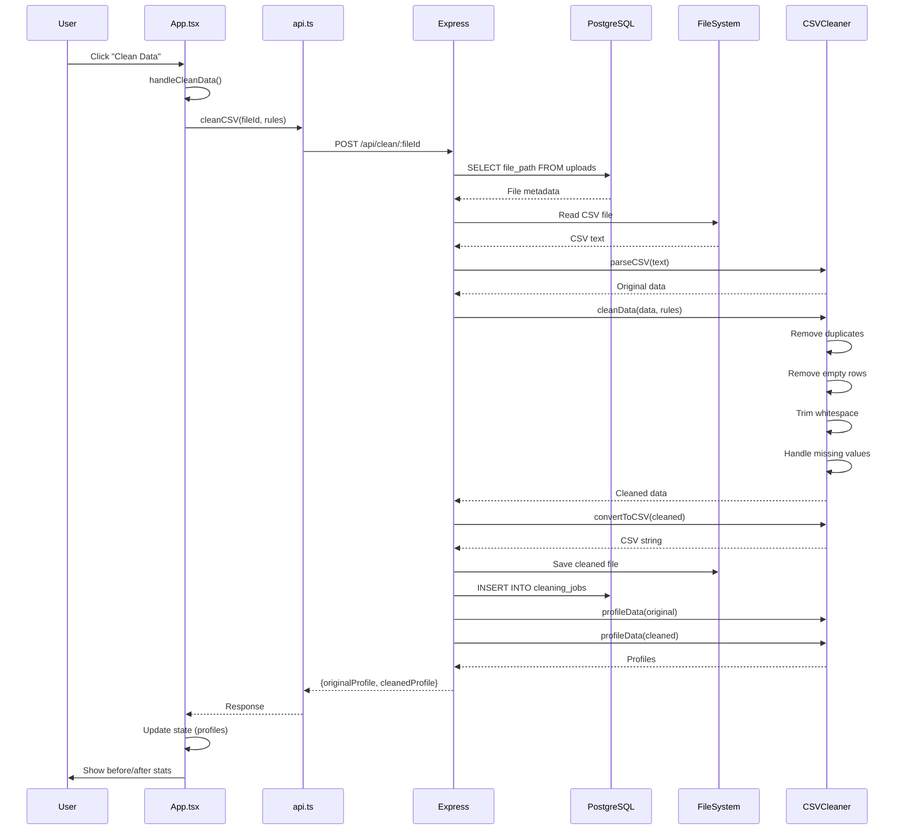
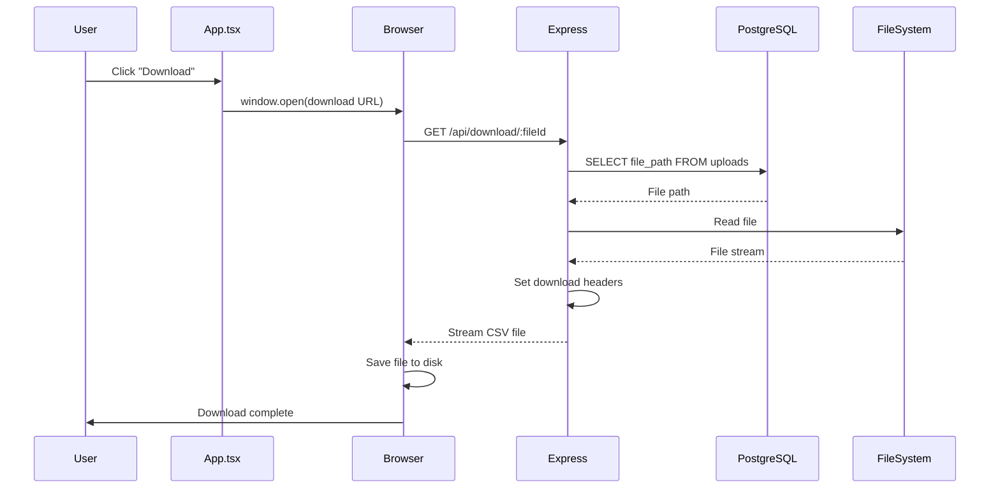
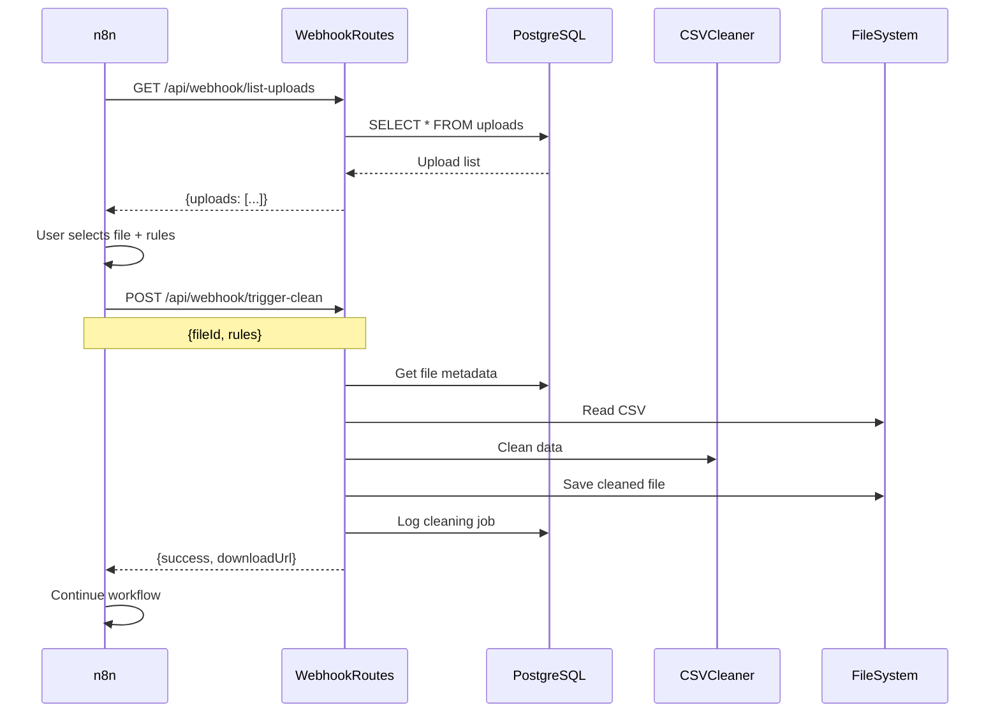
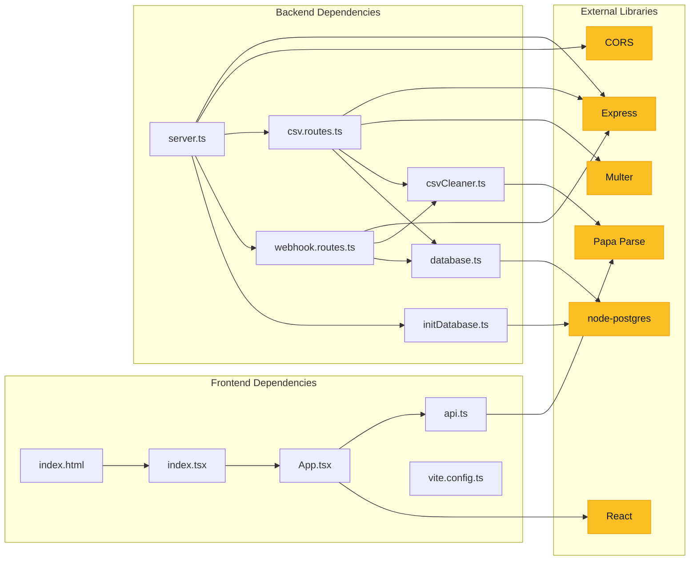
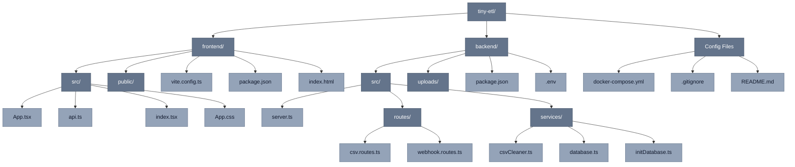
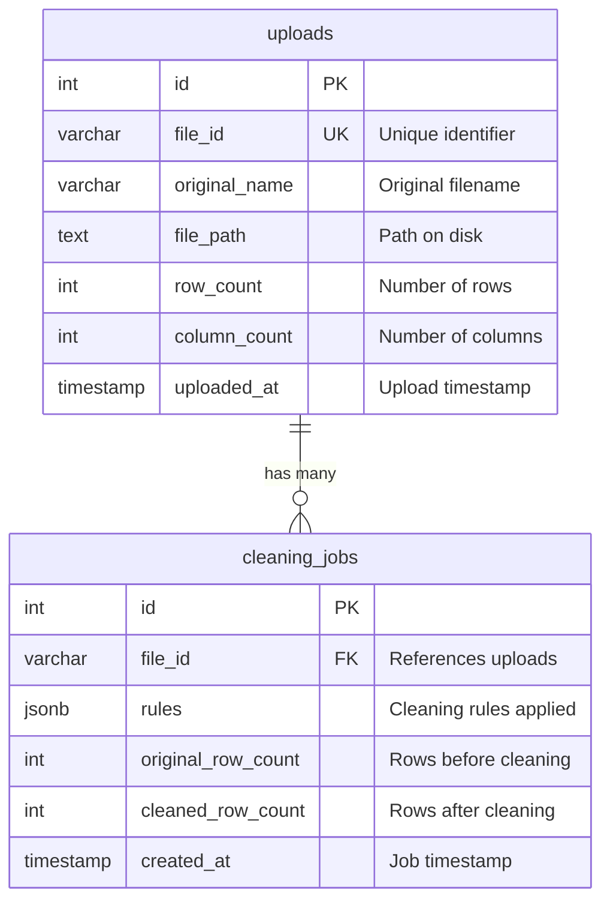
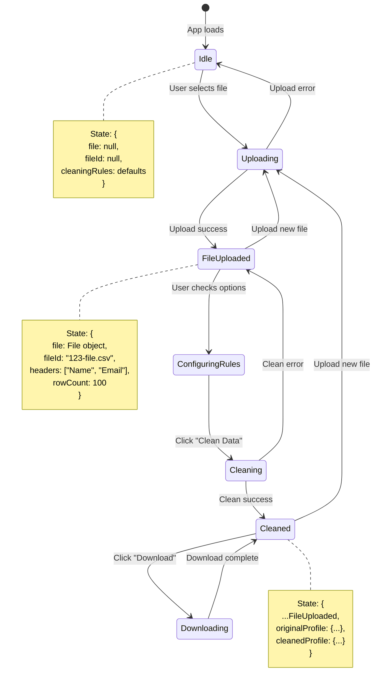
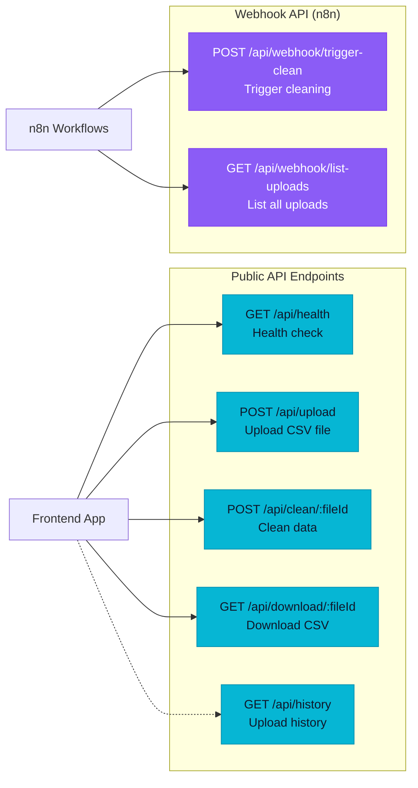

# Tiny ETL Studio - Complete Architecture Diagram

## System Architecture Overview

## Detailed Data Flow Diagrams

### 1. File Upload Flow

### 2. Data Cleaning Flow

### 3. Download Flow

### 4. n8n Workflow Integration

## Component Dependency Map

## File System Structure

## Database Schema

## State Management Flow (Frontend)

## API Endpoint Map

